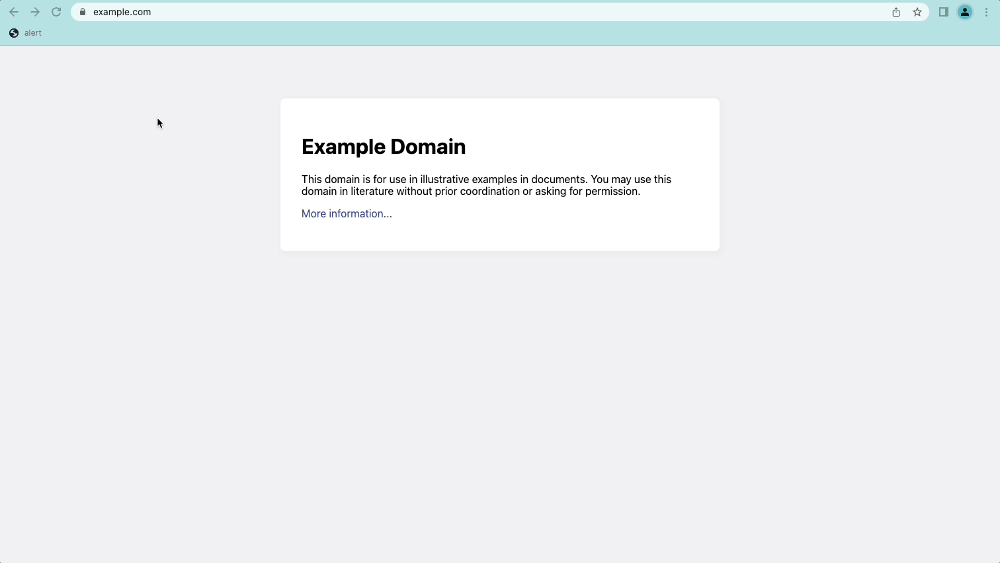
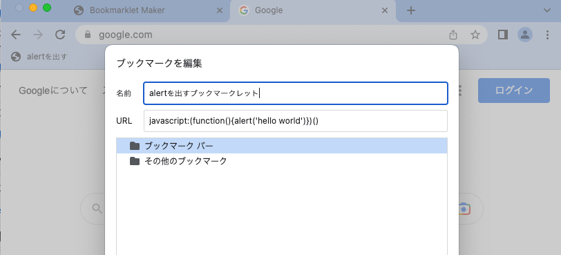
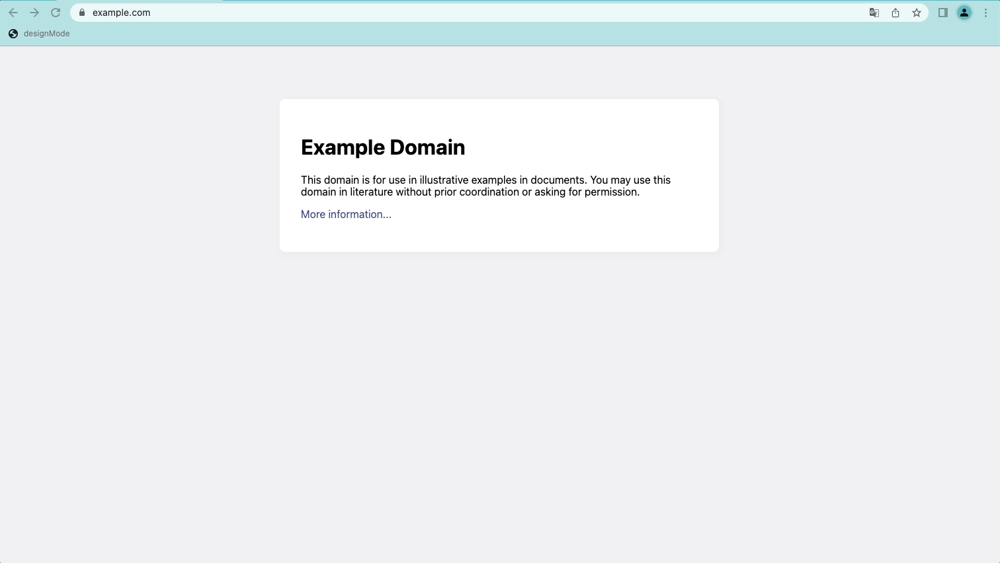

<style>
img[alt~="center"] {
  display: block;
  margin: 0 auto;
}
</style>

# ブックマークレットを使おう！

株式会社SmartHR プロダクトエンジニア
宮脇 駿

---

:muscle: ハードル激低ポイント

# <!-- fit --> 出てくるコードは2行だけです

---

# <!-- fit --> ブックマークレット使ってますか？

---

# ブックマークをクリックするとJavaScriptが動きます



--- 

# 作り方はブックマークのURLにスクリプトを書くだけ

```JavaScript
javascript:(function(){alert('hello world')})()
```



---

# つまり、Chrome拡張を作らなくてもお手軽に便利機能が作れる！

---

# よく使うブックマークレット

---

# HTML上の文字を自由に書き換える

資料用のキャプチャを撮る際などに手直しをするのに便利

```JavaScript
javascript:(function(){document.designMode = 'on'})()
```



参考：https://developer.mozilla.org/ja/docs/Web/API/Document/designMode

---

# 便利なブックマークレットを見つけたら周りの人に共有して、みんなで幸せになろう！

---

# おわり
